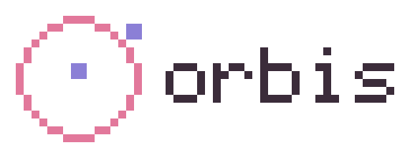

<p align="center"></p>

<p align="center"><b>your life, one dashboard.</b></p>

<div align="center">

<!-- cozy:repo -->
<div align="center">

<a href="https://github.com/orbis-hub/orbis"><picture><source media="(prefers-color-scheme: dark)" srcset="https://raw.githubusercontent.com/orbis-hub/orbis/output/repo-dark.svg?v=5997c2c21a"></picture></a>

</div>
<!-- /cozy:repo -->

</div>

<p align="center">
  <a href="https://github.com/orbis-hub/orbis/wiki/Getting-Started">getting started</a> ·
  <a href="https://github.com/orbis-hub/orbis/wiki/Install">install</a> ·
  <a href="https://github.com/orbis-hub/orbis/wiki/Module-Developer-Guide">build a module</a> ·
  <a href="https://github.com/orbis-hub/orbis/wiki">wiki</a> ·
  <a href="https://github.com/orbis-hub/registry">registry</a> ·
  <a href="https://github.com/orbis-hub/orbis/issues?q=is%3Aissue+is%3Aopen+label%3A%22module+idea%22">module ideas</a>
</p>

orbis is a self-hosted, modular life manager. one **hub** you run yourself (a pi is plenty), **dashboards** you lay out with drag and drop, and **modules** for everything on them: todos, calendar, weather, music, smart home, whatever someone writes next. web, android/ios and e-ink displays all talk to the same hub. no cloud, no account with us, your data stays in one sqlite file at home.

## install

```bash
curl -fsSL https://raw.githubusercontent.com/orbis-hub/orbis/main/install.sh | sh      # linux · macos · raspberry pi
irm https://raw.githubusercontent.com/orbis-hub/orbis/main/install.ps1 | iex           # windows
```

the installer asks whether this machine runs **hub + web** (one container, the usual case), **hub only** or **web only**. docker required. open `http://<host>:3001`, create the owner account, add widgets. more ways to run it, env vars, https and backups: [install](https://github.com/orbis-hub/orbis/wiki/Install).

## what's in the box

| module | widgets | page |
| --- | --- | --- |
| **clock** | digital clock | |
| **todo** | list, due today | lists & tasks with due dates |
| **weather** | current, forecast | hours and 7 days, open-meteo, no api key |
| **calendar** | agenda, month, next up | ics feeds + caldav (google, icloud, nextcloud, fastmail …) |
| **media** | now playing, playback devices | spotify or home assistant media players: search, playlists, queue, device picker, play in this browser |
| **home assistant** | switch/light, sensor + sparkline, climate, scenes, entity list | all your ha entities live over its websocket, and orbis as a device in ha via mqtt |
| **notes** | note, scratchpad | markdown-ish notes with checkboxes, autosave |
| **countdown** | countdown | days / weeks / hours to a date, yearly for birthdays |
| **hub status** | overview, single gauge | cpu, memory, disk, uptime, 30 min history |
| **habits** | today, habit grid | streaks, contribution-style grid, evening nudge |
| **bookmarks** | links | a start page with groups, favicons via the hub |
| **focus timer** | timer | pomodoro on the hub, shared across devices |
| **birthdays** | upcoming | people and dates, reminders a week before and on the day |
| **feeds** | headlines | rss / atom, mark read, favicons |
| **shopping list** | list | quick add with quantities, aisle templates (`@fruit`, `@obst` …) and automatic aisle detection from the item name, suggestions from past buys, store mode in supermarket order |
| **shelly** | switch, power overview | gen1 + gen2 shellys on the lan, mdns discovery, watts |
| **transport** | departures | next departures from a stop with delays, stop search with city / district / state, "near me", map with the route of a departure, germany-wide (db) + vbb/bvg/öbb |
| **mealplan** | today's meals | week grid, recipe import from any food blog url, "add this week's ingredients" → shopping |
| **finance** | money left, accounts | balances you type in, recurring costs, "left this month", csv import, blur for wall displays |
| **fitness** | this week, last workouts | strava sync, ingest url for apple health shortcuts / scripts, this week vs last as pixel bars |
| **waste collection** | next collections, this week | when the bins go out: schedule by address (mymüll / jumomind), ical feed or manual rules, reminder the evening before, e-ink |

plus: several dashboards, multi-user with owner/admin/member roles and private or shared dashboards, a lan device scanner that smart home modules build on, a module store fed by a registry, light/dark. everything else is a module away: see the [module ideas](https://github.com/orbis-hub/orbis/issues?q=is%3Aissue+is%3Aopen+label%3A%22module+idea%22) or write your own.

## modules

a module is a folder with a `module.json`, a `dist/server.js` that runs inside the hub and a `dist/client.js` that renders widgets and pages in the app. install from the store at runtime, no hub rebuild. react and the design system come from the host, so module bundles are tiny and look native.

```bash
# use the template → github.com/orbis-hub/module-template
pnpm dev --dev=<hub data dir>   # hot-reloads into a running hub
pnpm pack:module                # module.tgz for a release
```

[module developer guide](https://github.com/orbis-hub/orbis/wiki/Module-Developer-Guide) · [sdk reference](https://github.com/orbis-hub/orbis/wiki/SDK-Reference) · [publishing](https://github.com/orbis-hub/orbis/wiki/Publishing-and-Registry)

## languages

the ui speaks the hub's language: settings → hub → language (english and german today). modules bring their own translations as flat json files next to `module.json`:

```
modules/core-todo/
  module.json          "languages": ["en", "de"]
  locales/en.json      { "manifest.name": "Todo", "widget.list.name": "Todo list", "quickAdd.placeholder": "add a task…", "due": { "one": "{count} task due", "other": "{count} tasks due" } }
  locales/de.json      { "manifest.name": "Aufgaben", ... }
```

`orbis-module build` copies them to `dist/locales/`, the hub translates `manifest.*`, `widget.<id>.*` and `page.<id>.*` for the store and the sidebar, and in code you use `const t = useT()` from `@orbis/sdk/client` (`t("quickAdd.placeholder")`, `t("due", { count: 3 })`) or `ctx.i18n.t(...)` on the server for notifications and e-ink. missing keys fall back to english, then to the key itself. `pnpm i18n:check` reports gaps across the app and all modules. the registry index lists `languages` per module so the store can show what a module speaks.

## repo

```
apps/hub            the server: hono + sqlite, auth, dashboards, module runtime, installer, device registry
apps/web            next.js 16 static export, the dashboard ui
apps/mobile         capacitor wrapper around the web build
packages/sdk        @orbis/sdk – the module contract (manifest schema, server context, client hooks)
packages/ui         @orbis/ui – design system + pixel icons
packages/module-tools   orbis-module build | watch | pack
modules/*           first-party modules, built like third-party ones
brand/              logo + wordmark generator
```

```bash
pnpm install && pnpm modules:build
pnpm hub     # http://localhost:3001
pnpm web     # http://localhost:3000
```

[development setup](https://github.com/orbis-hub/orbis/wiki/Development-Setup) · [architecture](https://github.com/orbis-hub/orbis/wiki/Architecture) · [hub api](https://github.com/orbis-hub/orbis/wiki/Hub-API) · [contributing](https://github.com/orbis-hub/orbis/wiki/Contributing)

## activity

<div align="center">

<!-- cozy:commits -->
<div align="center">

<a href="https://github.com/orbis-hub/orbis/commits"><picture><source media="(prefers-color-scheme: dark)" srcset="https://raw.githubusercontent.com/orbis-hub/orbis/output/commits-dark.svg?v=d1d33c920b"></picture></a>

</div>
<!-- /cozy:commits -->

<!-- cozy:releases -->
<div align="center">

<a href="https://github.com/orbis-hub/orbis/releases"><picture><source media="(prefers-color-scheme: dark)" srcset="https://raw.githubusercontent.com/orbis-hub/orbis/output/releases-dark.svg?v=d1eda79c02"></picture></a>

</div>
<!-- /cozy:releases -->

<!-- cozy:contributors -->
<div align="center">

<a href="https://github.com/orbis-hub/orbis/graphs/contributors"><picture><source media="(prefers-color-scheme: dark)" srcset="https://raw.githubusercontent.com/orbis-hub/orbis/output/contributors-dark.svg?v=03aab6c3f8"></picture></a>

</div>
<!-- /cozy:contributors -->

</div>

## roadmap

- [x] hub, web, sdk, module store, device scanner, accounts, installer
- [x] 21 first-party modules, from clock to waste collection
- [x] languages: english and german across the app and every module, translations per module as json
- [x] notifications (bell, ntfy, telegram), backup & restore, kiosk mode, dashboard accents
- [x] e-ink: hub renderer, firmware for inkplate / lilygo / waveshare, web flasher, taps reach widgets
- [x] shelly direct via the device registry, orbis as a device in home assistant (mqtt)
- [x] store modules run isolated in worker threads with enforced permissions
- [ ] npm packages for the sdk ([#12](https://github.com/orbis-hub/orbis/issues/12))
- [ ] sonos / mpd / jellyfin in the media module ([#28](https://github.com/orbis-hub/orbis/issues/28)), hue direct
- [ ] android apk, ios

mit licensed. made by [vensin](https://vensin.dev).
